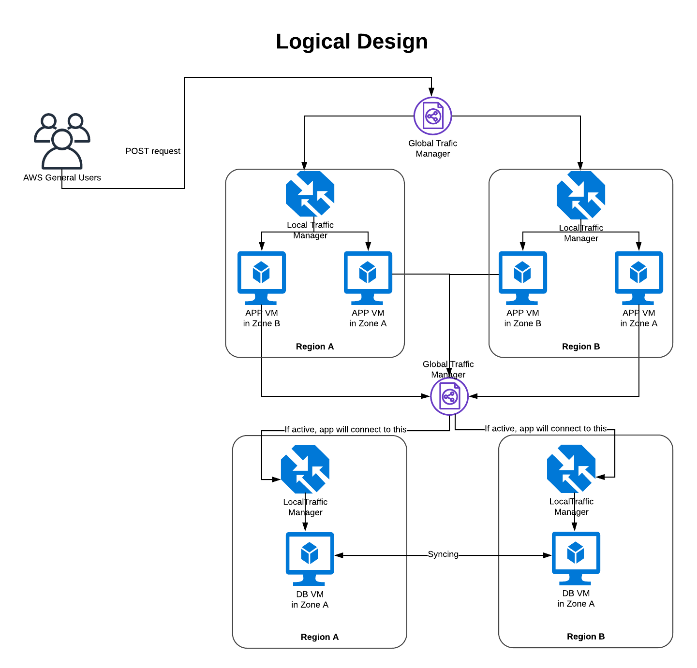
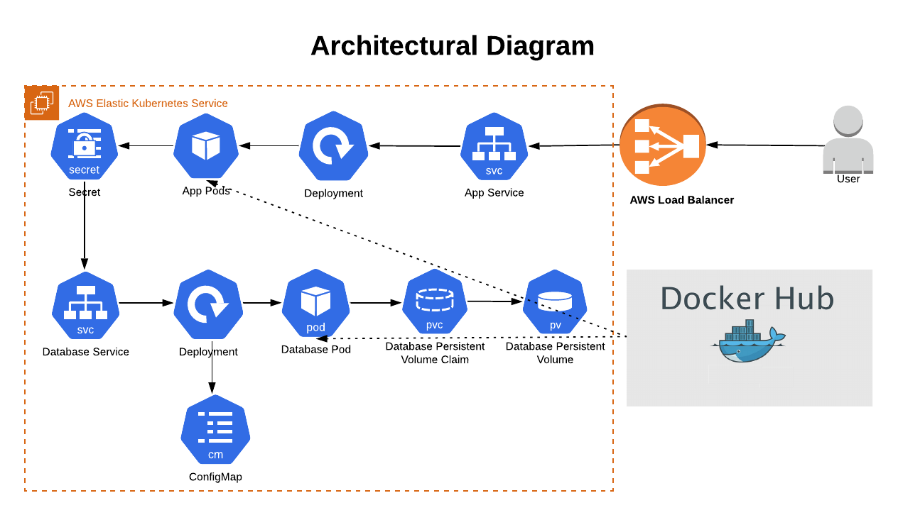

# Introduction
This project will deploy a simple Python based API. It has couple of POST methods. You can use one method to insert date-time stamp into your database while one method to see existing data from the database. The application is scaleable and have persistent data in case of application failure or unexpected crash of database. Below you can see logical diagram of the solution and architecture diagram of one of the possible solutions. There are also PDFs (architecture.pdf, logical_design.pdf) available in the repository 

## Logical design and Architecture diagram



## How to test if POC is working?
Use one or all of the below curl commands 

* To get welcome/landing message
```
 curl -X POST http://{HOST}
 ```
 * To insert the DateTime stamp into the database
```
 curl -X POST http://{HOST}/app
 ```
 * To get data from database
```
 curl -X POST http://{HOST}/show
 ```
 HOST has one of the below values;
 1. a387bfbc1b8dd11ea98b40ad3723e932-2083732890.eu-west-2.elb.amazonaws.com
 2. ip1
 3. ip2
 4. ip3

 Monitoring solution can be access via 


 ## Solution Explanation
 ***IMPORTANT:*** The solution was deployed and tested on Ubuntu 18 and on MAC catalina version 10.15.5
 ### Prerequisites
* [Amazon AWS account](https://aws.amazon.com/)
* [AWS Configured](https://docs.aws.amazon.com/cli/latest/reference/configure/)
* [Amazon CLI](https://aws.amazon.com/cli/)
* [Amazon EKS CLI](https://eksctl.io/)
* [Kubernetes CLI](https://kubernetes.io/docs/tasks/tools/install-kubectl/)
* [Docker](https://docs.docker.com/get-docker/)

 #### Get source code
 ```
  git clone https://github.com/abubakar-malik/vf.git
 ```
 #### Create EKS cluster
  ```
 cd scripts/
 ./createEKScluster.sh
 ```
 This should take 5-10 minutes to setup EKS cluster for you. Meanwhile you can create a Docker image as described below
 #### Create Docker image
 ```
 cd docker/
 sudo docker build --tag vf .
 sudo docker login --username={DOCKERHUB_USER_NAME}
 sudo docker images
 sudo docker tag {IMAGE_ID} {DOCKERHUB_USER_NAME}/vf:latest
 sudo docker images
 sudo docker push {DOCKERHUB_USER_NAME}/vf:latest
 ```
 #### Deploy APP/DB stack
 ```
 kubectl apply -k ./
 ```
 This will run kustomization.yaml exists in the root directory of the repo. kustomization.yaml will create kubernetes resources required to run application and database. This will also create an AWS loadbalancer to access application.
 #### Test APP/DB
 You can run below command to check if resources have been created successfully in Kubernetes
 ```
 kubectl get all
 ```
 for full end to end testing you can run below to check if app is running and inserting/retrieving data from database
 ```
 curl -X POST http://{HOST}
 curl -X POST http://{HOST}/show
 curl -X POST http://{HOST}/app
 ```
 where HOST can be AWS Loadbalancer name or one of the IPs it's resolving to.
 #### Scale up and auto scaling
 You can scale up and scale down the solution vertically by increasing number of pods or horizontally by increasing number of nodes. For example;
 ```
 kubectl scale deployment app --replicas=3

 eksctl scale nodegroup --cluster=vf-eks-cluster --nodes=5 {NODE_GROUP_ID}
 ```
 You can also setup autoscaling based on CPU utilization for example;
 ```
 kubectl autoscale deployment app --min=2 --max=10 --cpu-percent=80
 ```
 *Verification*
 ```
 kubectl get pods -o wide
 ```
 #### Deploy Monitoring stack
 ```
 kubectl apply -k ./monitoring/
 ```
 This will run kustomization.yaml exists in the *monitoring* directory. kustomization.yaml will create kubernetes resources required to run monitoring system Prometheus. This will also create an AWS loadbalancer to access Prometheus.
 #### Testing Monitoring stack
 Once deployed successfully, Prometheus should be available as per below;
 ```
 http://{HOST}:9090/
 ```
 where HOST can be AWS Loadbalancer name or the IP(s) it's resolving to.
 #### Cleanup
 You can use these steps to cleanup Kubernetes resources 
 ```
 kubectl delete -k ./monitoring/
 kubectl delete -k ./
 ```
 Finally run below to delete AWS EKS cluster
 ```
 cd scripts/
 ./destroy.sh
 ```
 ## Explanation of the solution
 The journey of the creation started with  writing a Python script for API which can handle POST requests to inser the date-time
stamp into the database.
 MySQL was used as a database because it's quite easy and I have experience mainly with relational databases.
 Next step was to create a Docker container for the app which takes environment variable to connect to a database and insert/retrieve data.
 AWS managed Kubernetes (EKS) is used to host the application and database. 
 Kubernetes resources like Deloyment,Pod and Service are being used to deploy and expose the app which helps to scale up and down the application. 
 Kubernetes secret is used to encrypt database login details.
 For database, I used mysql:5.7 container image. Kubernetes PersistentVolumeClaim resource has been used to save database data in case of database accidental crash or failure.
 AWS Loadbalancer have been created to access application and monitoring application Prometheus

 ## Why chosen this solution?
 I choose this solution because it was easy as Kubernetes cluster is managed by AWS so I only had to deploy the applications and scale if required. I passed kubernetes certification course but never really had a chance to deploy any production or production like application. I thought this is a good opportunity. 
 ## Other solution(s) I wanted to do?
 There were couple of other options I could use. I did
 1. Create database in AWS using Terraform and Use EKS cluster for application deployment. Leveraging a PaaS service for databases brings the following benefits: 
    * High availability with 99.99% SLA, fully managed by AWS
    * Version patching fully managed by AWS
    * Backup and recovery
 2. Use Terraform to create AWS EC2s, loadbalancer and use Ansible to deploy the application
 3. Use Vagrant to spin up VMs, deploy application via Ansible and use Nginx as front-end proxy to serve the application
 ## Improvements
 There's always room of improvements. I didn't have much time to implement some of these. But I believe below improvements can be made to the solution
 * Create a CI/CD Pipeline
 * Use an ElasticIP and/or DNS with Kubernetes Ingress controller 
 * Use SSL cert for outbound URL
 * Spend more time on creating Prometheus jobs
 * User monitoring solution like Grafana